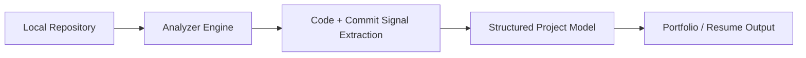

# Joaquin Almora

Backend-oriented software engineer building developer tools and systems that analyze and automate software workflows. Interested in backend architecture, developer infrastructure, and AI-assisted engineering tools.

## Featured Projects

### [Project Analyzer (Capstone)](https://github.com/COSC-499-W2025/capstone-project-team-7)

Desktop application that analyzes local repositories and converts code, commit history, and project artifacts into structured portfolio and resume entries. The system processes repositories locally, extracts relevant signals from source code and git history, and generates structured project descriptions developers can reuse.

**Stack:** Next.js • TypeScript • FastAPI • Python • Supabase • Electron

#### Architecture

### [CommitGen](https://github.com/joaquinalmora/commitgen)

CLI tool that generates structured commit messages directly from git diffs and integrates with git hooks to enforce consistent commit history. Designed to streamline commit workflows and reduce manual formatting while keeping commit logs structured and readable.

**Stack:** Go • Git Hooks

### [Course Hover Info](https://github.com/joaquinalmora/hover-course)

Chrome extension that augments UBC course pages with grade distributions and professor ratings using injected UI overlays and aggregated APIs. The extension dynamically enriches university course pages with contextual information without modifying the original site.

**Stack:** JavaScript • Chrome Extensions

## Contract Work

### WhatsApp Receipt Processing System

Backend system that processes receipt images through OpenAI Vision and returns structured confirmations via WhatsApp. Built with a queued processing pipeline and reliability safeguards including retry queues, dead-letter storage, stale-confirmation suppression, and deployment validation checks.

Achieved ~0.78s median end-to-end processing latency.

## Open Source Work

When I have time I like contributing fixes and improvements to infrastructure and developer tooling projects. I've contributed to tools like [Kubetail](https://github.com/kubetail-org/kubetail) (a Kubernetes log-streaming CLI), where I implemented authentication caching to reduce repeated auth requests, added RBAC permissions for log access, and updated CI to support additional Ubuntu architectures. I’ve also submitted fixes to [Nautobot](https://github.com/nautobot/nautobot) (network automation) and [Grafana k6](https://github.com/grafana/k6) (performance testing), mainly improving reliability and error handling in edge cases such as missing configuration or clearer runtime errors. I also proposed a caching improvement for [go-fast-cdn](https://github.com/kevinanielsen/go-fast-cdn), exploring a Redis bloom-filter approach to reduce CDN metadata size while maintaining fast lookups.

## Currently

- Exploring AI-assisted developer workflows and diffusion coding models  
- Publishing my first iOS game, a word-based puzzle game (Sudoku-style logic with words).

## GitHub Stats

## Connect

<a href="mailto:joaquin.almora@gmail.com">
 joaquin.almora@gmail.com
</a>
 
<a href="https://linkedin.com/in/jalmora">
 LinkedIn
</a>

