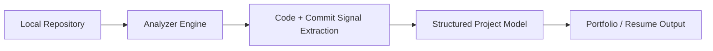

# Joaquin Almora

Backend-oriented software engineer building developer tools and systems that analyze and automate software workflows. Interested in backend architecture, developer infrastructure, and AI-assisted engineering tools.

## Featured Projects

### [Project Analyzer (Capstone)](https://github.com/COSC-499-W2025/capstone-project-team-7)

Desktop application that analyzes local repositories and converts source code, commit history, and project artifacts into structured portfolio and resume entries.

**Stack:** Next.js • TypeScript • FastAPI • Python • Supabase • Electron

#### Architecture

### [CommitGen](https://github.com/joaquinalmora/commitgen)

CLI tool that generates structured commit messages directly from git diffs and integrates with git hooks to enforce consistent commit history. Designed to streamline commit workflows and reduce manual formatting while keeping commit logs structured and readable.

**Stack:** Go • Git Hooks

### [Course Hover Info](https://github.com/joaquinalmora/hover-course)

Chrome extension that augments UBC course pages with grade distributions and professor ratings using injected UI overlays and aggregated APIs. The extension dynamically enriches university course pages with contextual information without modifying the original site.

**Stack:** JavaScript • Chrome Extensions

## Contract Work

### WhatsApp Receipt Processing System

Backend system that processes receipt images through OpenAI Vision and returns structured confirmations via WhatsApp. Built with a queued processing pipeline and reliability safeguards including retry queues, dead-letter storage, stale-confirmation suppression, and deployment validation checks.

Achieved ~0.78s median end-to-end processing latency.

## Open Source Work

Contributions to infrastructure and developer tooling projects.

**[Kubetail](https://github.com/kubetail-org/kubetail)** – Kubernetes log-streaming CLI  
- Implemented authentication caching to reduce repeated auth requests  
- Added RBAC permissions for log access  
- Expanded CI to support additional Ubuntu architectures  

**[Nautobot](https://github.com/nautobot/nautobot)** – Network automation platform  
- Improved error handling and runtime messaging for configuration issues  

**[Grafana k6](https://github.com/grafana/k6)** – Performance testing tool  
- Fixed reliability issues in edge cases involving missing configuration  

**[go-fast-cdn](https://github.com/kevinanielsen/go-fast-cdn)** – CDN metadata service  
- Proposed Redis bloom-filter caching approach to reduce metadata size while maintaining fast lookups

## Currently

- Exploring AI-assisted developer workflows and diffusion coding models  
- Publishing my first iOS game, a word-based puzzle game (Sudoku-style logic with words).

## Connect

<a href="mailto:joaquin.almora@gmail.com">
 joaquin.almora@gmail.com
</a>
 
<a href="https://linkedin.com/in/jalmora">
 LinkedIn
</a>

